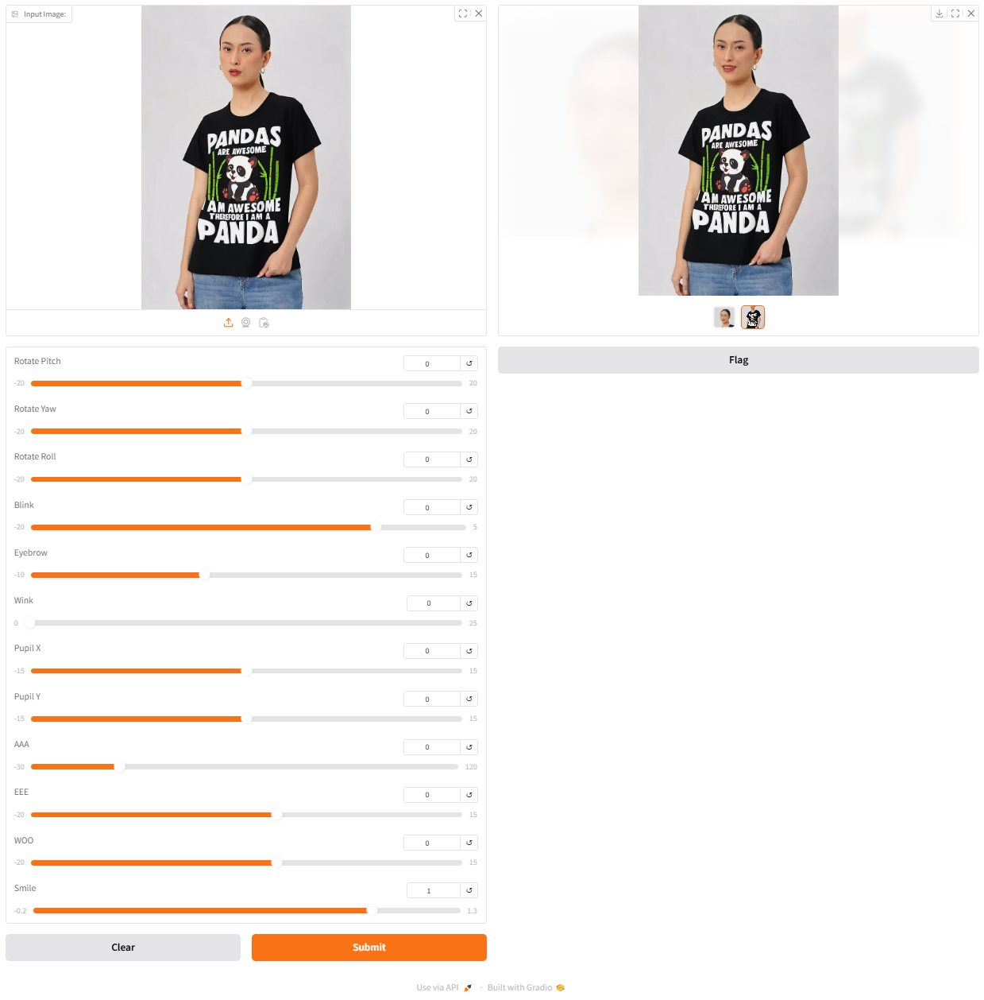

# FLOW
- Set Database using db.sql file
- Run ComfyUI
- Run Cloth Swap/Expression Editing etc
- Run Restfull Api
# Expression Editing Tool & Cloth Swap API

## Important Notes
- Input images should be of HD resolution to achieve better results.

## Overview
- Expression Editing
- Cloth Swap
- Eye Details
- Eye Lip Face
- Hair
- Makeup
- Character Generation

## Requirements
1. Install the ComfyUI framework.
2. Create a `.env` file in your working directory with these variables:
   - `DB_PASSWORD`

3. Install required libraries:
   ```bash
   pip install -r requirements.txt
   ```

4. Additional packages for the Cloth Swap API:
   - `json`
   - `random`
   - `uuid`
   - `datetime`
   - `pathlib`
   - `PIL` (Pillow library)

5. Ensure the following files are in your working directory:
   - `settings.py`: Should define `COMFY_UI_PATH`, `EXPRESSION_WORKFLOW`, and `CLOTH_SWAP_WORKFLOW`.
   - `websockets_api.py`: Must implement the `get_prompt_images` function.
## How to Use
Run ComfyUI Portable -> Run resful_api.py -> Run exp. character_generation.py

## User Interface

### Inputs
## Interface Previews
1. **Cloth Swap**: 
2. **Expression Editing**: 
3. **Cloth and Background Editing**: .png)
## References
- ComfyUI Workflow:
  1. Expression Editing: [Video Link](https://www.youtube.com/watch?v=q0Vf-ZZsbzI&t=150s)
  2. Cloth Swap: [Video Link](https://youtu.be/WXmkLih9jfk?si=6vHraq-s49P4DLPb)

- Acknowledgment to tutorials by YT Code Crafters Corner: 
  - [Video Link 1](https://youtu.be/kmZqoLJ2Dhk?si=DNN4nE5mue5cXzx2)
  - [Video Link 2](https://youtu.be/1iPcRGyj7-E?si=zaAQ88xsFFSI8CBI)
  - [Video Link 3](https://youtu.be/zajODlpfOs4?si=depOaJViLMTNPAnlS)

- https://thefuturethinker.org/new-comfyui-pulid-flux-2-tutorial-guide-better-than-reactor-faceswap/
